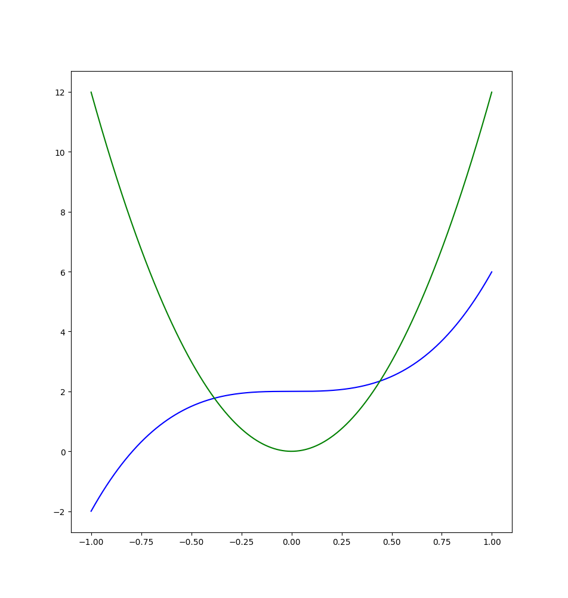

# derive
Calculate the derivative of a function non-algebraically

[](https://github.com/JakeRoggenbuck/derive/actions)

## Build
- Run `./scripts/build.sh`

## Config
You can replace this function with anything you would like to find the derivative of.
```c
double function(double x) {
  // f(x) = x^3 + 4x + 2
  return (pow(x, 3) + 4 * x) + 2;
}
```

## Run
- Run `./cmake/derive > data/out.csv`
- Run `python3 plotting/main.py`


